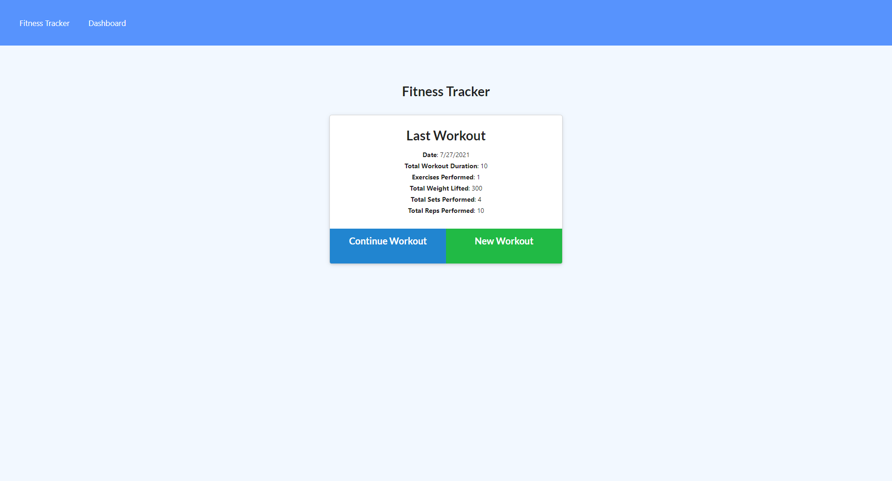
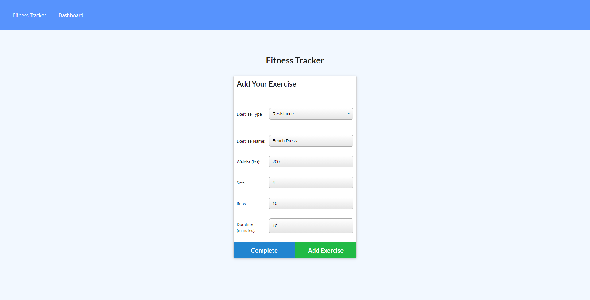
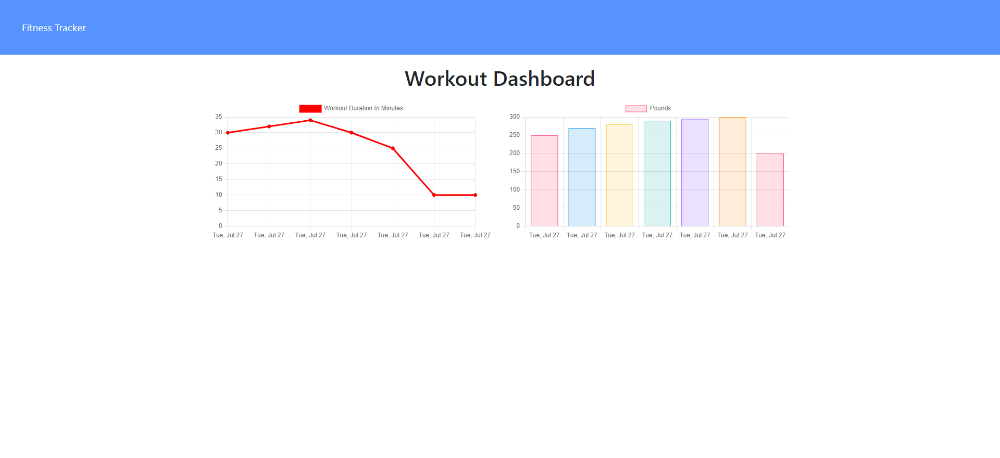

# workout_track
## Description
Workout Tracker utilizes Mongodb to maintain a serverside database of workouts that are sent to a front end application that allows you to display past workouts and add exercises to new workouts. As a project, Workout Tracker was a demonstration of using the Mongo database framework for webdevelopment.
## Table of Contents
- [Installation](#installation)
- [Usage](#usage)
- [Credits](#credits)
- [License](#license)
## Installation
Deployed Link: https://powerful-wave-98733.herokuapp.com/
## Usage
Screenshots:

## Credits
https://github.com/Randy-chou
## License

## Features
From a user perspective, Workout Tracker allows for the viewing of a current workout. It also allows you to add cardio or resistance exercises to a current workout. Once a workout is completed, you can start a new workout to add exercises too. Workouts are stored serverside and users can visit a dashboard to view weight and duraiton statistics about the past seven workouts.
## How to Contribute
N/A
## Tests
N/A